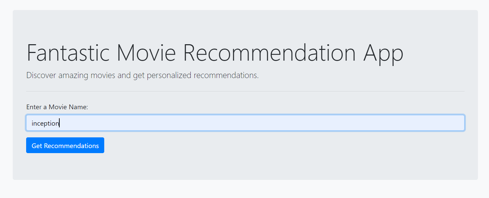
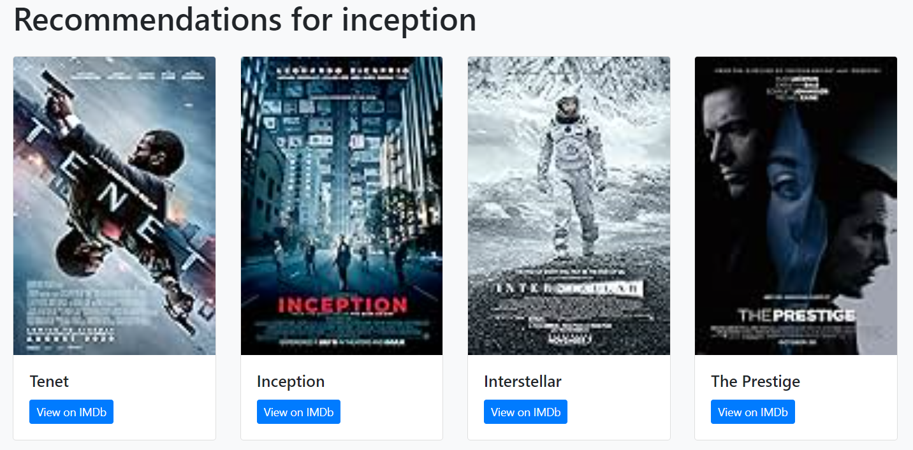

# movie-recommendation-system

## Overview

Movie Recommendation System App! This simple web application provides movie recommendations based on user input. It uses web scraping to gather information from IMDb and displays movie recommendations along with images. 

##  Project Steps

1. **User Input:**
    - The user enters a movie name in the input field on the web app's home page.
2. **Cache Check:**
    - The app checks its cache to see if recommendations for the entered movie are already available.
    - If the movie is found in the cache, the app retrieves the recommendations directly from the cache.
3. **IMDb Scraping if not in cache** ( Cache Miss )**:**
    - The app searches IMDb's top 250 movies to find the closest match to the user's input.
    - It uses fuzzy matching to improve the accuracy of matching movie names.
    - The app then scrapes IMDb to get detailed information about the selected movie and its related movies.
    - It follows links to the director's IMDb page to find a list of movies the director is known for.
    - The backend extracts relevant information such as movie titles, IMDb links, and movie images from the director's known-for list.
4. **Caching (after IMDb Scraping):**
    - The obtained recommendations are stored in the cache for future use, improving response time for repeated requests.
5. **Flask Backend:**
    - The Flask web server, running the backend of the app, receives the form submission.
6. **Preparing Recommendations:**
    - The backend creates a list of movie recommendations with titles, IMDb links, and image URLs.
7. **Displaying Results:**
    - The backend sends this list of recommendations back to the frontend.
8. **Frontend Rendering:**
    - The Flask app renders a new HTML page (**`recommendations.html`**) with details about the user's input and the recommended movies.
    - The movie titles, IMDb links, and image URLs are displayed on the page.
9. **Image Display on Web App:**
    - The frontend dynamically loads and displays the movie images fetched from IMDb alongside their titles and links.
10. **User Interaction:**
    - The user can see the recommended movies along with their images and IMDb links
   
## Web App Home Page and Recommendtion Page

